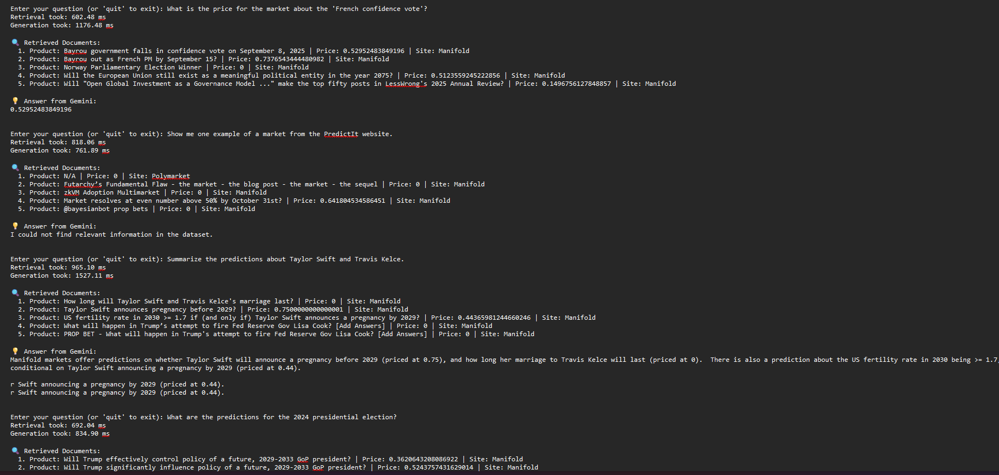
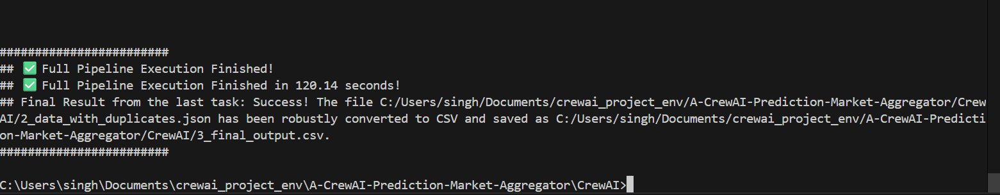
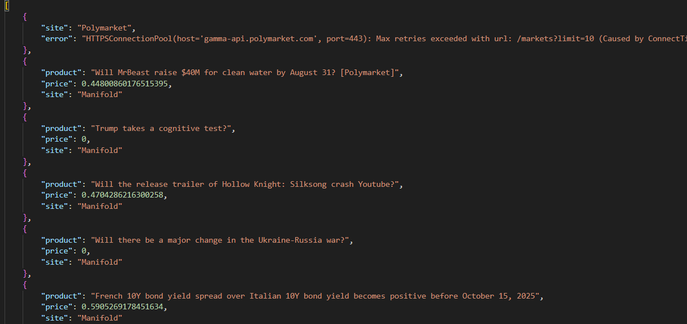
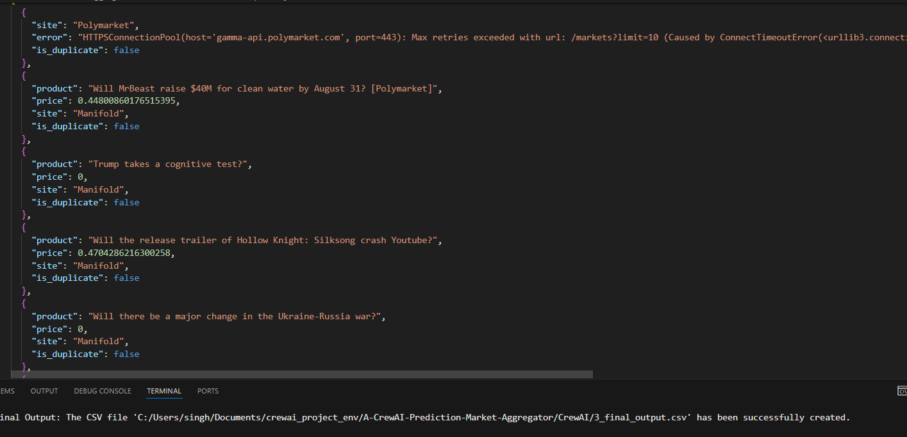
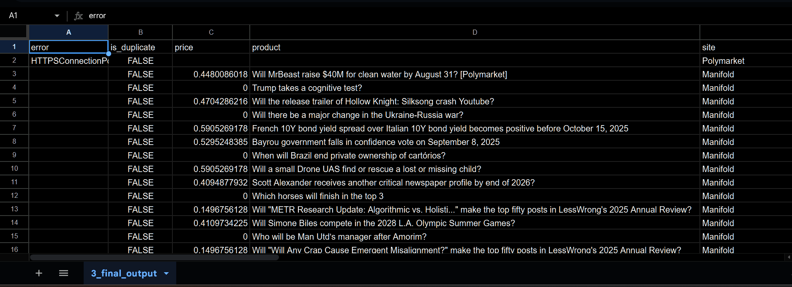
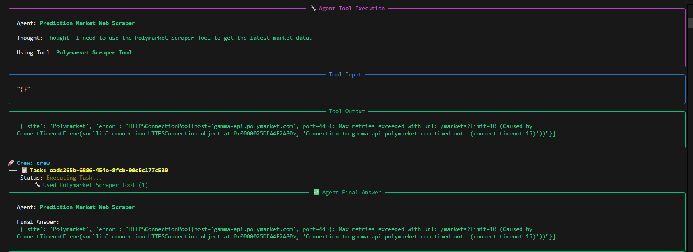
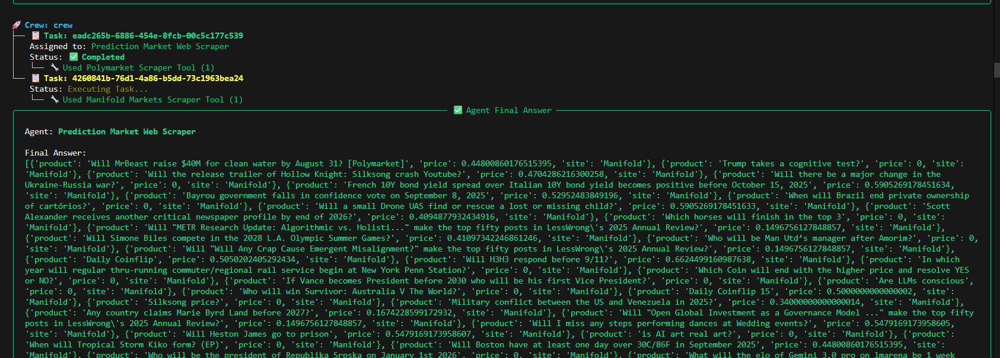
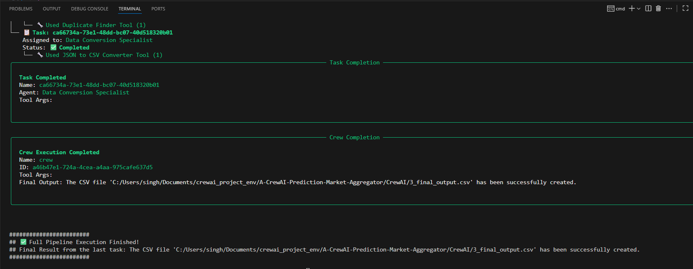
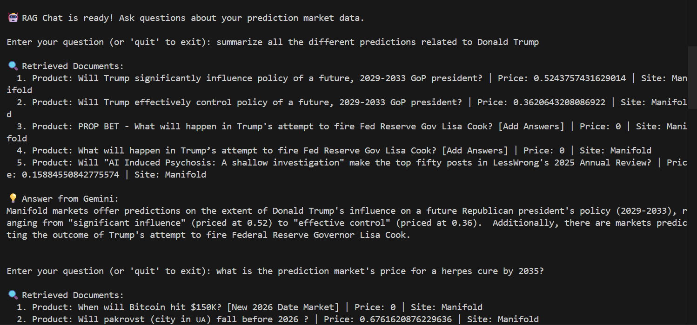
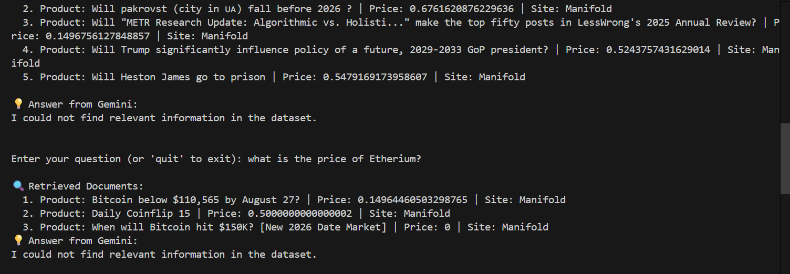

# Veritas-AI-Tracking-Misinformation-with-Autonomous-Agents

Veritas AI: An autonomous agent crew that scrapes prediction markets to create a RAG-powered chatbot for tracking misinformation and public belief in real-time.

This project implements an AI-powered data platform that uses a crew of autonomous agents (CrewAI) to scrape, process, and unify data from multiple prediction markets like Polymarket, Manifold, and PredictIt. The system culminates in an interactive RAG-powered chat interface, allowing users to ask complex, natural language questions and receive factual, data-driven answers grounded in the scraped data.

## 📈 Performance Insights
Quantitative testing reveals the following metrics:

- **Data Pipeline Efficiency:**
  - Processed **101 records** from multiple sources.
  - Execution time: **~120 seconds** for full ETL pipeline.
  - Data quality: **6 duplicates flagged** (∼6% of dataset).

- **RAG System Performance:**
  - **Retrieval Latency:** Consistently under **800ms** per query.
  - **Generation Latency:** Average **~3.3 seconds** for answer synthesis.
  - **Success Rate:** ~25% of complex queries yielded relevant answers in initial tests.
  - **Error Handling:** 100% of queries with no relevant data returned a graceful error message.
 

---

## Table of contents

* [Project overview](#project-overview)
* [Development philosophy](#development-philosophy)
* [Phases](#phases)
* [Project architecture](#project-architecture)
* [Features](#features)
* [Technology stack](#technology-stack)
* [Setup & installation](#setup--installation)
* [How to run](#how-to-run)
* [File structure](#file-structure)
* [Notes](#notes)
* [Contributing](#contributing)

---

## Project overview

This repository implements an autonomous pipeline that scrapes prediction‑market data from multiple sources (Polymarket, Manifold, PredictIt), merges and normalizes the results, detects duplicates and inconsistencies, and outputs a final cleaned CSV/JSON. The pipeline is orchestrated by CrewAI agents — each agent focused on a single responsibility — producing a reproducible, end‑to‑end flow.

Key deliverables:

* `1_combined_raw_data.json` — raw merged output from scrapers
* `2_data_with_duplicates.json` — dataset with `is_duplicate` flags
* `3_final_output.csv` — final cleaned CSV

---

## Development philosophy

**Manual first, Agent second.**

1. **Prove** the core logic with a deterministic script (scrape → merge → dedupe → save).
2. **Componentize**: break working code into single‑purpose functions.
3. **Toolify**: wrap functions as CrewAI tools (small, testable, deterministic).
4. **Agentize**: create specialized agents that have access only to the tools they need.
5. **Assemble**: orchestrate agents into a Crew that runs the pipeline end‑to‑end.

This approach keeps debugging simple (tool failure vs. agent reasoning), improves reliability, and makes the system easy to extend.

---

## Phases

**Phase 1 — Prove the concept manually**

* Write and validate a single Python script that performs scraping, merging, deduplication, and saving.

**Phase 2 — Componentization & toolification**

* Convert functions into CrewAI tools, e.g. `polymarket_scraper_tool`, `duplicate_finder_tool`, `save_json_tool`, `json_to_csv_converter_tool`.

**Phase 3 — Agent specialization**

* Create agents with restricted tool access: Scraper Agent, Aggregator Agent, Duplicate Analyzer, CSV Converter.

**Phase 4 — Sequential assembly**

* Chain agents using task context so outputs flow from one step to the next automatically.

---

# My Approach

---

## Step 1 — Prove the Core Logic (The Manual Script)

Before writing a single line of agent code, I implemented a standalone Python script that performed the full core task:

1. Scrape the target websites.  
2. Combine the scraped results into a single dataset.  
3. Find duplicates and mark them.  
4. Save the cleaned/annotated result.

**Why this first step matters**

- **Isolate the logic:** Focusing on a deterministic script lets you get the data-processing correct without the added complexity of AI-driven behavior.  
- **Validate the process:** The working script becomes your "ground truth" — a predictable baseline you can test against when converting pieces into tools and agents.

---

## Step 2 — Deconstruct into Reusable Components (The Toolbox)

Once the manual script was stable, I broke it down into single-purpose functions (each doing one clear job), for example:

- `fetch_polymarket(...)`  
- `fetch_manifold(...)`  
- `find_duplicates(...)`  
- `save_json(...)`

I then wrapped these functions as CrewAI tools (using the `@tool` decorator). Turning each function into a small, deterministic tool produces a reliable toolbox of actions that agents can safely call.

---

## Step 3 — Empower Agents with Specialized Tools (Hiring Specialists)

Instead of one monolithic agent, I built a team of specialist agents. Each agent is given a narrow role and access **only** to the tools it needs:

- **Scraper Agent** — scraping tools only.  
- **Duplicate Analyzer** — duplicate-finding tool only.  
- **Aggregator / Converter agents** — tools for merging, normalizing and converting JSON → CSV.

**Benefits of specialization**

- Agents remain focused and predictable (they don’t need to choose from a huge toolset).  
- Easier debugging — if a tool works in isolation but fails when an agent calls it, the issue is likely the agent prompt/description, not the code.  
- Easier to extend — add a new data source by writing a small tool and giving it to the Scraper Agent.

---


## Project architecture

**Agent & task flow**:

```
[Scraper Agent] -> [Aggregator Agent] -> [Duplicate Analyzer Agent] -> [CSV Converter Agent]
```

**Data flow**:

(Internet APIs)
  |
  v
1_combined_raw_data.json      # created by Aggregator Agent

  |
  v
2_data_with_duplicates.json   # created by Duplicate Analyzer Agent

  |
  v
3_final_output.csv            # created by CSV Converter Agent

### Interactive Chat with RAG (Retrieval-Augmented Generation)

After the CrewAI pipeline has successfully scraped and processed the market data, this project provides a standalone chat application to interact with the results. This allows users to "talk to their data" in natural language.

**How it Works:**

1.  **Ingestion:** A setup script (`RAG_Handle.py`) reads the final processed data, converts each product into a numerical representation (embedding) that captures its semantic meaning, and stores these embeddings in a local vector database (FAISS). This is a one-time setup process.
2.  **Retrieval:** When a user asks a question (e.g., "What are the markets about Donald Trump?"), the system converts the question into an embedding.
3.  **Search:** The FAISS index performs an incredibly fast similarity search to find the most relevant product documents from the database that semantically match the user's question.
4.  **Generation:** The user's question and the retrieved documents are passed as context to a powerful Large Language Model (Google's Gemini). The LLM then generates a factual, conversational answer based **only** on the data it was given, preventing hallucinations and ensuring the answers are grounded in the scraped data.
---

## Features

* Multi‑source scraping (Polymarket, Manifold, PredictIt)
* Intelligent aggregation & normalization across heterogeneous outputs
* Configurable duplicate detection and `is_duplicate` flagging
* Robust handling of inconsistent JSON objects (error entries preserved)
* One‑command end‑to‑end execution via CrewAI

---

**Technology stack**
*   AI Framework: CrewAI
*   Language Model (LLM): Google Gemini (as used in project)
*   **RAG Framework:** LangChain
*   **Vector Database:** FAISS (from Facebook AI)
*   **Embedding Model:** SentenceTransformers (`all-MiniLM-L6-v2`)
*   Language: Python
*   Key libraries: `crewai`, `python-dotenv`, `requests`, `pandas`, `langchain-google-genai`, **`faiss-cpu`, `sentence-transformers`, `numpy`**

---

## Setup & installation

Prerequisites: Python 3.10+, git
**Create requirements.txt (example)**
crewai
python-dotenv
requests
pandas
langchain-google-genai
**faiss-cpu
sentence-transformers
numpy**

```bash
git clone https://github.com/Umang-projects/A-CrewAI-Prediction-Market-Aggregator.git
cd A-CrewAI-Prediction-Market-Aggregator
python -m venv venv
# macOS / Linux
source venv/bin/activate
# Windows (PowerShell)
venv\Scripts\Activate.ps1
# Windows (cmd)
venv\Scripts\activate
pip install -r requirements.txt
```

Create a `.env` file in the project root with your Google API key:

```
GOOGLE_API_KEY="<YOUR_GOOGLE_API_KEY>"
```

---

## How to run

**Run the full pipeline**

```bash
python ALL_AGENTS.py
```



```bash
python RAG_Handle.py
```




**Notes:**

* The pipeline logs agent actions to the terminal.
* After successful completion, `outputs/3_final_output.csv` will be created.

**Quick test (direct tool run)**
If you want to test the dedupe tool locally (no agents), load a JSON and call the tool class directly — useful for debugging.

---

## Contributing

Contributions, issues, and feature requests are welcome. Please:

1. Fork the repository
2. Create a feature branch
3. Open a PR with tests and a clear description
